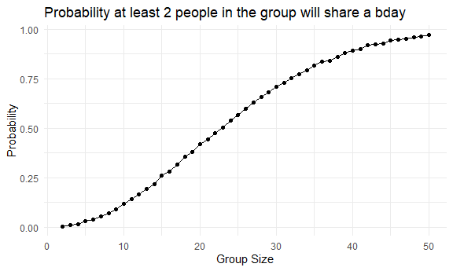
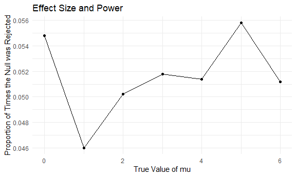
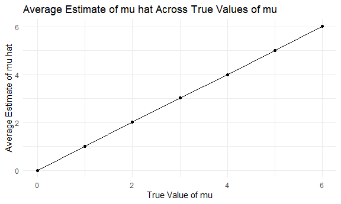
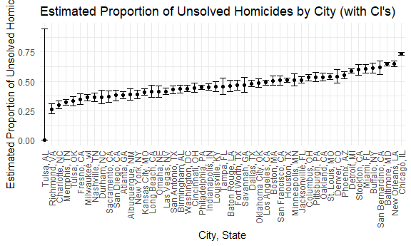

P8105 HW5
================
Sijda Ahmed (sa4007)

``` r
# load in necessary packages
library(tidyverse)
```

    ## ── Attaching core tidyverse packages ──────────────────────── tidyverse 2.0.0 ──
    ## ✔ dplyr     1.1.4     ✔ readr     2.1.5
    ## ✔ forcats   1.0.0     ✔ stringr   1.5.2
    ## ✔ ggplot2   4.0.0     ✔ tibble    3.3.0
    ## ✔ lubridate 1.9.4     ✔ tidyr     1.3.1
    ## ✔ purrr     1.1.0     
    ## ── Conflicts ────────────────────────────────────────── tidyverse_conflicts() ──
    ## ✖ dplyr::filter() masks stats::filter()
    ## ✖ dplyr::lag()    masks stats::lag()
    ## ℹ Use the conflicted package (<http://conflicted.r-lib.org/>) to force all conflicts to become errors

``` r
library(ggplot2)
library(broom)

# default options
knitr::opts_chunk$set(
  fig.width = 6,
  fig.asp = .6,
  out.width = "90%"
)

theme_set(theme_minimal() + theme(legend.position = "bottom"))

options(
  ggplot2.continuous.colour = "viridis",
  ggplot2.continuous.fill = "viridis"
)

scale_colour_discrete = scale_colour_viridis_d
scale_fill_discrete = scale_fill_viridis_d
```

## Problem 1

``` r
bday_sim = function(n_room) {
  
  birthdays = sample(1:365, n_room, replace = TRUE)
  repeated_bday = length(unique(birthdays)) < n_room
  repeated_bday
  
}

bday_sim_results = 
  expand_grid(
    bdays = 2:50, 
    iter = 1:10000
  ) |> 
  mutate(
    result = map_lgl(bdays, bday_sim)
  ) |> 
  group_by(
    bdays
  ) |> 
  summarize(
    prob_repeat = mean(result) 
  )

bday_sim_results |> 
  ggplot(aes(x = bdays, y = prob_repeat)) + 
  geom_point() + 
  geom_line() +
  labs(
    x = "Group Size",
    y = "Probability",
    title = "Probability at least 2 people in the group will share a bday"
  )
```



As the group size increases, the probability of at least 2 people in a
group will share a birthday across the 10000 simulations also increases.

## Problem 2

``` r
sim_mean_pval = function(mu, n_subj= 30, sigma = 5) {
  
  sim_df = 
    tibble(
      x = rnorm(n = n_subj, mean = mu, sd = sigma)
    )
  
  sim_df |> 
    summarize(
      mu_hat = mean(x),
      pval = broom::tidy(t.test(x, mu = mu))$p.value
    )
  
}

# Creating 7 lists (a list for each true value of mu)
mu0 = vector("list", length = 5000)
mu1 = vector("list", length = 5000)
mu2 = vector("list", length = 5000)
mu3 = vector("list", length = 5000)
mu4 = vector("list", length = 5000)
mu5 = vector("list", length = 5000)
mu6 = vector("list", length = 5000)

# 7 lists of 5000 data frames
for (i in 1:5000) {
  
  mu0[[i]] = sim_mean_pval(mu = 0);
  mu1[[i]] = sim_mean_pval(mu = 1);
  mu2[[i]] = sim_mean_pval(mu = 2);
  mu3[[i]] = sim_mean_pval(mu = 3);
  mu4[[i]] = sim_mean_pval(mu = 4);
  mu5[[i]] = sim_mean_pval(mu = 5);
  mu6[[i]] = sim_mean_pval(mu = 6)
  
}
```

``` r
results = 
  tibble(
    true_mean = 0:6,
    pprop = 0:6,
    avg_muhat = 0:6
  )

results$pprop[[1]] = mean(map_dbl(mu0, "pval") < 0.05)
results$pprop[[2]] = mean(map_dbl(mu1, "pval") < 0.05)
results$pprop[[3]] = mean(map_dbl(mu2, "pval") < 0.05)
results$pprop[[4]] = mean(map_dbl(mu3, "pval") < 0.05)
results$pprop[[5]] = mean(map_dbl(mu4, "pval") < 0.05)
results$pprop[[6]] = mean(map_dbl(mu5, "pval") < 0.05)
results$pprop[[7]] = mean(map_dbl(mu6, "pval") < 0.05)

results |>
  ggplot(aes(x = results$true_mean, y = results$pprop)) +
  geom_point() +
  geom_line() +
  labs(
    x = "True Value of mu",
    y = "Proportion of Times the Null was Rejected",
    title = "Effect Size and Power"
  )
```

    ## Warning: Use of `results$true_mean` is discouraged.
    ## ℹ Use `true_mean` instead.

    ## Warning: Use of `results$pprop` is discouraged.
    ## ℹ Use `pprop` instead.

    ## Warning: Use of `results$true_mean` is discouraged.
    ## ℹ Use `true_mean` instead.

    ## Warning: Use of `results$pprop` is discouraged.
    ## ℹ Use `pprop` instead.



When the true value of mu is 2 or more, the proportion of times the null
was rejected (the power of the test) is smaller when the true value of
mu is greater.

``` r
results$avg_muhat[[1]] = mean(map_dbl(mu0, "mu_hat"))
results$avg_muhat[[2]] = mean(map_dbl(mu1, "mu_hat"))
results$avg_muhat[[3]] = mean(map_dbl(mu2, "mu_hat"))
results$avg_muhat[[4]] = mean(map_dbl(mu3, "mu_hat"))
results$avg_muhat[[5]] = mean(map_dbl(mu4, "mu_hat"))
results$avg_muhat[[6]] = mean(map_dbl(mu5, "mu_hat"))
results$avg_muhat[[7]] = mean(map_dbl(mu6, "mu_hat"))

results |>
  ggplot(aes(x = results$true_mean, y = results$avg_muhat)) +
  geom_point() +
  geom_line() +
  labs(
    x = "True Value of mu",
    y = "Average Estimate of mu hat",
    title = "Average Estimate of mu hat Across True Values of mu"
  )
```

    ## Warning: Use of `results$true_mean` is discouraged.
    ## ℹ Use `true_mean` instead.

    ## Warning: Use of `results$avg_muhat` is discouraged.
    ## ℹ Use `avg_muhat` instead.

    ## Warning: Use of `results$true_mean` is discouraged.
    ## ℹ Use `true_mean` instead.

    ## Warning: Use of `results$avg_muhat` is discouraged.
    ## ℹ Use `avg_muhat` instead.



As the true value of mu increases, the average estimate of mu hat also
increases. The average estimate of mu hat is very close to the true
value of mu.

## Problem 3

``` r
homicide_data = read_csv("data/homicide-data.csv") |>
  mutate(
    city_state = paste(city, state, sep = ", ")
  ) 
```

    ## Rows: 52179 Columns: 12
    ## ── Column specification ────────────────────────────────────────────────────────
    ## Delimiter: ","
    ## chr (9): uid, victim_last, victim_first, victim_race, victim_age, victim_sex...
    ## dbl (3): reported_date, lat, lon
    ## 
    ## ℹ Use `spec()` to retrieve the full column specification for this data.
    ## ℹ Specify the column types or set `show_col_types = FALSE` to quiet this message.

``` r
city_totals =
  homicide_data |>
  group_by(city_state) |>
  summarize(
    total_homicides = n(),
    unsolved_homicides = sum(disposition %in% c("Closed without arrest", "Open/No arrest"))
  )

city_totals |>
  knitr::kable()
```

| city_state         | total_homicides | unsolved_homicides |
|:-------------------|----------------:|-------------------:|
| Albuquerque, NM    |             378 |                146 |
| Atlanta, GA        |             973 |                373 |
| Baltimore, MD      |            2827 |               1825 |
| Baton Rouge, LA    |             424 |                196 |
| Birmingham, AL     |             800 |                347 |
| Boston, MA         |             614 |                310 |
| Buffalo, NY        |             521 |                319 |
| Charlotte, NC      |             687 |                206 |
| Chicago, IL        |            5535 |               4073 |
| Cincinnati, OH     |             694 |                309 |
| Columbus, OH       |            1084 |                575 |
| Dallas, TX         |            1567 |                754 |
| Denver, CO         |             312 |                169 |
| Detroit, MI        |            2519 |               1482 |
| Durham, NC         |             276 |                101 |
| Fort Worth, TX     |             549 |                255 |
| Fresno, CA         |             487 |                169 |
| Houston, TX        |            2942 |               1493 |
| Indianapolis, IN   |            1322 |                594 |
| Jacksonville, FL   |            1168 |                597 |
| Kansas City, MO    |            1190 |                486 |
| Las Vegas, NV      |            1381 |                572 |
| Long Beach, CA     |             378 |                156 |
| Los Angeles, CA    |            2257 |               1106 |
| Louisville, KY     |             576 |                261 |
| Memphis, TN        |            1514 |                483 |
| Miami, FL          |             744 |                450 |
| Milwaukee, wI      |            1115 |                403 |
| Minneapolis, MN    |             366 |                187 |
| Nashville, TN      |             767 |                278 |
| New Orleans, LA    |            1434 |                930 |
| New York, NY       |             627 |                243 |
| Oakland, CA        |             947 |                508 |
| Oklahoma City, OK  |             672 |                326 |
| Omaha, NE          |             409 |                169 |
| Philadelphia, PA   |            3037 |               1360 |
| Phoenix, AZ        |             914 |                504 |
| Pittsburgh, PA     |             631 |                337 |
| Richmond, VA       |             429 |                113 |
| Sacramento, CA     |             376 |                139 |
| San Antonio, TX    |             833 |                357 |
| San Bernardino, CA |             275 |                170 |
| San Diego, CA      |             461 |                175 |
| San Francisco, CA  |             663 |                336 |
| Savannah, GA       |             246 |                115 |
| St. Louis, MO      |            1677 |                905 |
| Stockton, CA       |             444 |                266 |
| Tampa, FL          |             208 |                 95 |
| Tulsa, AL          |               1 |                  0 |
| Tulsa, OK          |             583 |                193 |
| Washington, DC     |            1345 |                589 |

The raw data includes the homicide victims names, race, age, sex, city,
state, and disposition of the homicide case. The total number of
homicides and the number of unsolved homicides are shown above.

``` r
Baltimore_totals = 
  homicide_data |>
  filter(city_state == "Baltimore, MD") |>
  summarize(
    total = n(),
    unsolved = sum(disposition %in% c("Closed without arrest", "Open/No arrest"))
  )

Baltimore_test = prop.test(Baltimore_totals$unsolved, Baltimore_totals$total)
Baltimore_testtidy = broom::tidy(Baltimore_test)
Baltimore_estimate = Baltimore_testtidy$estimate
Baltimore_lowerCI = Baltimore_testtidy$conf.low
Baltimore_upperCI = Baltimore_testtidy$conf.high
```

For the city of Baltimore, MD, the estimated proportion of homicides
that are unsolved is 0.6455607 and the confidence interval is
\[0.6275625, 0.6631599\].

``` r
city_test =
  city_totals |>
  mutate(
    test = map2(unsolved_homicides, total_homicides, ~ prop.test(.x, .y)),
    testtidy  = map(test, broom::tidy)
  ) |>
  unnest(testtidy) |>
  mutate(
    conf_int = paste(conf.low, conf.high, sep = ", ")
  ) |>
  select(city_state, estimate, conf.low, conf.high, conf_int)
```

    ## Warning: There was 1 warning in `mutate()`.
    ## ℹ In argument: `test = map2(unsolved_homicides, total_homicides, ~prop.test(.x,
    ##   .y))`.
    ## Caused by warning in `prop.test()`:
    ## ! Chi-squared approximation may be incorrect

``` r
city_test |>
  knitr::kable()
```

| city_state | estimate | conf.low | conf.high | conf_int |
|:---|---:|---:|---:|:---|
| Albuquerque, NM | 0.3862434 | 0.3372604 | 0.4375766 | 0.337260384254284, 0.437576606555521 |
| Atlanta, GA | 0.3833505 | 0.3528119 | 0.4148219 | 0.352811897036302, 0.414821883953622 |
| Baltimore, MD | 0.6455607 | 0.6275625 | 0.6631599 | 0.627562457662644, 0.663159860401662 |
| Baton Rouge, LA | 0.4622642 | 0.4141987 | 0.5110240 | 0.414198741860307, 0.511023960018796 |
| Birmingham, AL | 0.4337500 | 0.3991889 | 0.4689557 | 0.399188948632167, 0.468955748189036 |
| Boston, MA | 0.5048860 | 0.4646219 | 0.5450881 | 0.464621930200304, 0.545088051772638 |
| Buffalo, NY | 0.6122841 | 0.5687990 | 0.6540879 | 0.568798964634228, 0.654087939253532 |
| Charlotte, NC | 0.2998544 | 0.2660820 | 0.3358999 | 0.26608198188312, 0.335899860867845 |
| Chicago, IL | 0.7358627 | 0.7239959 | 0.7473998 | 0.723995888425454, 0.747399787306647 |
| Cincinnati, OH | 0.4452450 | 0.4079606 | 0.4831439 | 0.407960574220688, 0.483143880618937 |
| Columbus, OH | 0.5304428 | 0.5002167 | 0.5604506 | 0.500216719334982, 0.560450554069058 |
| Dallas, TX | 0.4811742 | 0.4561942 | 0.5062475 | 0.456194154046593, 0.506247544691615 |
| Denver, CO | 0.5416667 | 0.4846098 | 0.5976807 | 0.484609835539695, 0.59768074787163 |
| Detroit, MI | 0.5883287 | 0.5687903 | 0.6075953 | 0.568790304428009, 0.607595332109926 |
| Durham, NC | 0.3659420 | 0.3095874 | 0.4260936 | 0.309587370745465, 0.426093646122628 |
| Fort Worth, TX | 0.4644809 | 0.4222542 | 0.5072119 | 0.422254218817489, 0.507211882429337 |
| Fresno, CA | 0.3470226 | 0.3051013 | 0.3913963 | 0.305101254947731, 0.391396303001031 |
| Houston, TX | 0.5074779 | 0.4892447 | 0.5256914 | 0.48924468839782, 0.52569143782639 |
| Indianapolis, IN | 0.4493192 | 0.4223156 | 0.4766207 | 0.422315592149053, 0.476620653261321 |
| Jacksonville, FL | 0.5111301 | 0.4820460 | 0.5401402 | 0.482045992882616, 0.540140220940324 |
| Kansas City, MO | 0.4084034 | 0.3803996 | 0.4370054 | 0.380399622526014, 0.437005420291775 |
| Las Vegas, NV | 0.4141926 | 0.3881284 | 0.4407395 | 0.388128427543561, 0.44073947345246 |
| Long Beach, CA | 0.4126984 | 0.3629026 | 0.4642973 | 0.362902632730428, 0.464297334473225 |
| Los Angeles, CA | 0.4900310 | 0.4692208 | 0.5108754 | 0.4692208307642, 0.510875439229204 |
| Louisville, KY | 0.4531250 | 0.4120609 | 0.4948235 | 0.412060862911807, 0.494823450153796 |
| Memphis, TN | 0.3190225 | 0.2957047 | 0.3432691 | 0.295704710084932, 0.343269132061918 |
| Miami, FL | 0.6048387 | 0.5685783 | 0.6400015 | 0.568578324827888, 0.64000148914404 |
| Milwaukee, wI | 0.3614350 | 0.3333172 | 0.3905194 | 0.333317185397031, 0.390519378344496 |
| Minneapolis, MN | 0.5109290 | 0.4585150 | 0.5631099 | 0.458514982041853, 0.563109883458537 |
| Nashville, TN | 0.3624511 | 0.3285592 | 0.3977401 | 0.32855921177063, 0.397740143098163 |
| New Orleans, LA | 0.6485356 | 0.6231048 | 0.6731615 | 0.623104762061361, 0.673161504551066 |
| New York, NY | 0.3875598 | 0.3494421 | 0.4270755 | 0.349442079407787, 0.427075473225884 |
| Oakland, CA | 0.5364308 | 0.5040588 | 0.5685037 | 0.504058764486028, 0.568503654694674 |
| Oklahoma City, OK | 0.4851190 | 0.4467861 | 0.5236245 | 0.446786082294775, 0.523624500045037 |
| Omaha, NE | 0.4132029 | 0.3653146 | 0.4627477 | 0.365314587740629, 0.46274774106504 |
| Philadelphia, PA | 0.4478103 | 0.4300380 | 0.4657157 | 0.43003802587334, 0.46571574030871 |
| Phoenix, AZ | 0.5514223 | 0.5184825 | 0.5839244 | 0.518482503921835, 0.58392440997268 |
| Pittsburgh, PA | 0.5340729 | 0.4942706 | 0.5734545 | 0.494270601334985, 0.573454475783427 |
| Richmond, VA | 0.2634033 | 0.2228571 | 0.3082658 | 0.222857090697159, 0.308265775687954 |
| Sacramento, CA | 0.3696809 | 0.3211559 | 0.4209131 | 0.321155936941272, 0.420913133871621 |
| San Antonio, TX | 0.4285714 | 0.3947772 | 0.4630331 | 0.394777213342685, 0.463033104312304 |
| San Bernardino, CA | 0.6181818 | 0.5576628 | 0.6753422 | 0.557662796603596, 0.675342223114347 |
| San Diego, CA | 0.3796095 | 0.3354259 | 0.4258315 | 0.335425902281662, 0.425831508201927 |
| San Francisco, CA | 0.5067873 | 0.4680516 | 0.5454433 | 0.468051609424123, 0.545443306766946 |
| Savannah, GA | 0.4674797 | 0.4041252 | 0.5318665 | 0.404125196559388, 0.531866539046565 |
| St. Louis, MO | 0.5396541 | 0.5154369 | 0.5636879 | 0.515436912252685, 0.563687859400505 |
| Stockton, CA | 0.5990991 | 0.5517145 | 0.6447418 | 0.551714515213198, 0.644741783449581 |
| Tampa, FL | 0.4567308 | 0.3881009 | 0.5269851 | 0.388100903021656, 0.5269851074937 |
| Tulsa, AL | 0.0000000 | 0.0000000 | 0.9453792 | 0, 0.945379244471148 |
| Tulsa, OK | 0.3310463 | 0.2932349 | 0.3711192 | 0.293234872894204, 0.371119167790918 |
| Washington, DC | 0.4379182 | 0.4112495 | 0.4649455 | 0.411249523972199, 0.46494547194691 |

The estimated proportions of proportion of unsolved homicides and CIs
for each city are shown in the table above.

``` r
city_test |>
  mutate(city_state = fct_reorder(city_state, estimate)) |>
  ggplot(aes(x = city_state, y = estimate)) +
  geom_point() +
  geom_errorbar(aes(ymin = conf.low, ymax = conf.high)) +
  labs(
    x = "City, State",
    y = "Estimated Proportion of Unsolved Homicides",
    title = "Estimated Proportion of Unsolved Homicides by City (with CI's)"
  ) +
  theme(axis.text.x = element_text(angle = 90, vjust = 0.5, hjust = 1))
```


